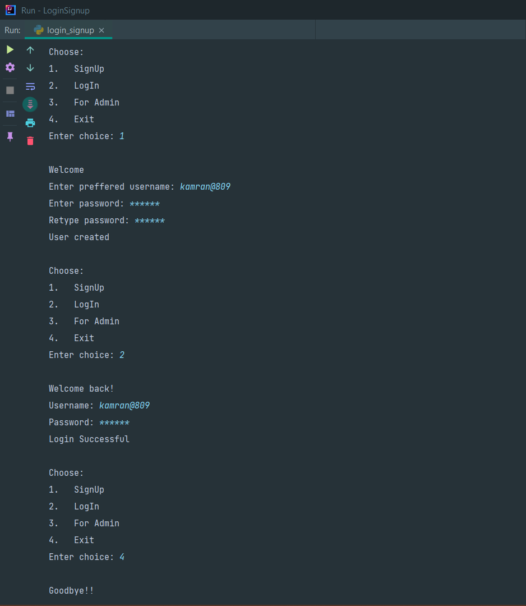

# Simple LogIn/SignUp

## Table of Contents
* [General Info](#general-information)
* [Technologies Used](#technologies-used)
* [Features](#features)
* [Screenshots](#screenshots)
* [Setup](#setup)
* [Project Status](#project-status)
* [Contact](#contact)

## General Information
A simple login and signup program using Python. This allows users to register and login. Also containing an Admin Login feature(under development).

All the credentials are stored in a `JSON` file after hashing. Usernames as well as passwords are encoded with MD5 hash encryption and the byte equivalent encoded string is stored as dictionay values in the `record_dict.json` file.

## Technologies Used
- Python
## Features
- Secured
- Clean Code
## Screenshots

## Setup
Use your preferred code editor or the command line to run the `login_signup.py` file.

## Project Status
Project is : _under development_

The Admin section needs to be enhanced for administrative operations. Other than this, no more changes required to the project.

## Contact
- Created by **Kamran Jameel**, Computer Science & Engineering, BCREC; 

Feel free to <a href="mailto:jameelk809@gmail.com">Email</a> me !!